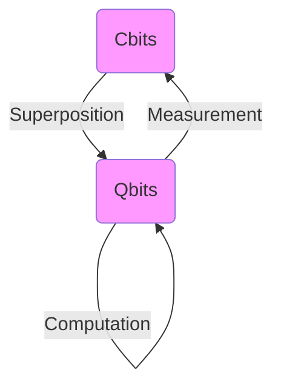
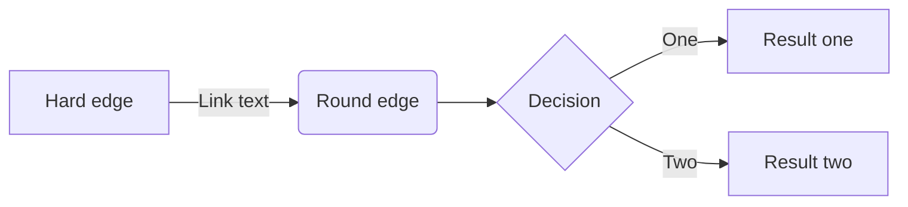
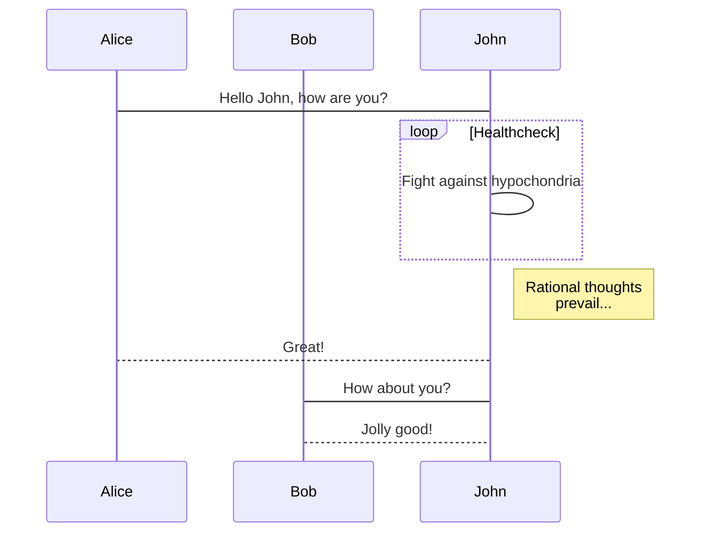

## What would you do?

```mermaid
graph TD
A(Cbits) -->|Superposition| B(Qbits)
B -->|Computation| B
B -->|Measurement| A
style A fill:#f9f
style B fill:#f9f
```

```mermaid
graph LR
    A[Hard edge] -->|Link text| B(Round edge)
    B --> C{Decision}
    C -->|One| D[Result one]
    C -->|Two| E[Result two]
```

```mermaid
sequenceDiagram
  participant Alice
  participant Bob
  Alice->John: Hello John, how are you?
  loop Healthcheck
      John->John: Fight against hypochondria
  end
  Note right of John: Rational thoughts <br/>prevail...
  John-->Alice: Great!
  John->Bob: How about you?
  Bob-->John: Jolly good!
```

